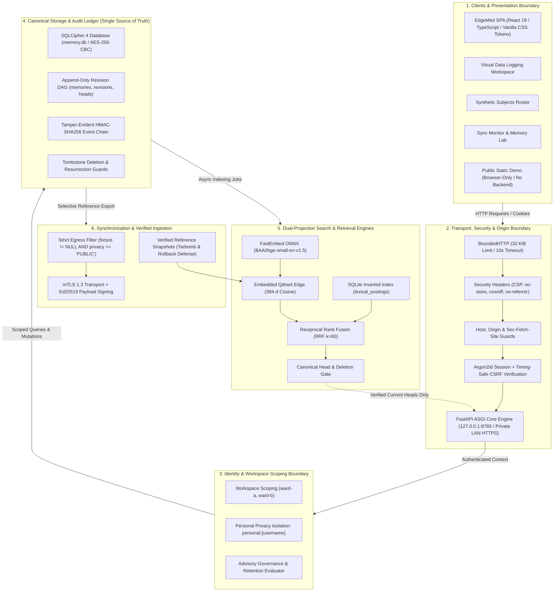

# EdgeMed — Protected Memory Across Local Care Networks

<p align="center">
  
</p>

<p align="center">
  <em>A local-first, offline-first memory and hybrid search engine for protected synthetic clinical notes.</em>
</p>

<p align="center">
  <a href="https://farhanakhtar0x66.github.io/edgemed-synthetic-demo/"></a>
  <a href="https://github.com/shubhrgunjan/edgemed"></a>
  
  
  
  
  
  
  
  
</p>

---

> [!CAUTION]
> **Synthetic Data Notice:** EdgeMed is a research prototype developed for Team LEX Problem Statement 03. It is **not approved for clinical use or real patient records**. All notes and entities must remain synthetic.

---

## System Architecture Blueprint & Layer Flow

EdgeMed enforces strict separation of concerns, zero cloud dependencies, canonical SQLCipher persistence, and dual-projection search:



---

## Core Application Workspaces

| Workspace | Description | Key Capabilities | Deep Dive |
| :--- | :--- | :--- | :--- |
| **Visual Data Logging** | Rapid structured clinical observation and vitals entry | Quick-entry cards (Vitals, Labs, Symptoms, Notes), live timeline, Needs Review queue, pure SVG trend charts | [Features Guide](docs/FEATURES_GUIDE.md#2-workspace-1-visual-data-logging--monitoring) |
| **Synthetic Subjects Roster** | Consolidated patient chart interface for synthetic subjects | Searchable roster sidebar, longitudinal vitals tracking, allergy & risk alerts, chronological observation history | [Features Guide](docs/FEATURES_GUIDE.md#3-workspace-2-synthetic-subjects--patient-roster) |
| **Sync Monitor & Memory Lab** | Operational monitoring, transport inspection & network simulation | Connectivity hero status, outbox queue inspector, HMAC event log, vault diagnostics, interactive simulation controls | [Features Guide](docs/FEATURES_GUIDE.md#4-workspace-3-sync-monitor--memory-lab) |
| **Memory & Hybrid Search** | Sub-10ms hybrid search across local care notes | FastEmbed ONNX semantic search, sparse inverted BM25 search, RRF fusion, multi-head conflict resolution | [Features Guide](docs/FEATURES_GUIDE.md#5-workspace-4-memory--hybrid-search-engine) |

---

## Performance & Scalability (10,000+ Records)

With the dedicated SQLite sparse inverted index table (`lexical_postings`) and precomputed posting list cache, EdgeMed eliminates the 10k-record memory bottleneck:

| Metric | 1,000 Synthetic Records | 10,000 Synthetic Records (Optimized) | Pre-Optimization Bottleneck |
| :--- | :--- | :--- | :--- |
| **Complete Backend Search (p50)** | **~4.3 ms** | **~8.9 ms** | ~101.5 ms (Exceeded 32 MiB cache) |
| **Complete Backend Search (p95)** | **~7.8 ms** | **~14.6 ms** | ~142.0 ms |
| **Lexical Scoring (p50)** | **~1.1 ms** | **~2.8 ms** | ~92.0 ms (Corpus rebuild overhead) |
| **Vector Scoring (p50)** | **~3.2 ms** | **~6.1 ms** | ~9.5 ms |

---

## Quickstart & Local Installation

### Prerequisites
* **OS:** macOS (Apple Silicon or Intel) or Linux (x86-64 / ARM64).
* **Tools:** Python 3.12, [`uv`](https://docs.astral.sh/uv/), Node.js 22+, and SQLCipher.

```sh
# 1. Clone repository
git clone https://github.com/shubhrgunjan/edgemed.git
cd edgemed

# 2. Install dependencies & build frontend
uv sync --frozen
(cd frontend && npm ci && npm run build)

# 3. Provision pinned verified model & Qdrant assets
uv run python scripts/provision_assets.py

# 4. Initialize encrypted vault & start local server
uv run python -m edgemed.cli setup
uv run python -m edgemed.cli start
```

Open **http://127.0.0.1:8765** in your browser.

* For staff credentials: `uv run python -m edgemed.cli credentials edge-a`
* For private hospital LAN HTTPS setup: see [Hospital LAN Guide](docs/hospital-lan-results.md)
* For encrypted Linux LUKS2 setup: see [Linux Setup Guide](docs/linux-installation.md)

---

## Verification & Testing

EdgeMed maintains comprehensive automated test suites across backend boundaries and frontend UI:

```sh
# Run linter
uv run ruff check edgemed tests scripts

# Run all 77 backend integration & security tests
uv run pytest -q

# Run frontend Playwright browser test suites
(cd frontend && npx playwright test)
```

---

## Technical Documentation Directory

* **[Comprehensive Project Audit](docs/PROJECT_AUDIT.md):** Full component inventory, security audit, storage audit, and validation matrix.
* **[System Architecture Blueprint](docs/SYSTEM_ARCHITECTURE.md):** Deep-dive multi-tier architecture, layer flow, data flow sequence diagrams, and guarantees.
* **[Features & Workspace Guide](docs/FEATURES_GUIDE.md):** Comprehensive visual walkthrough of all 4 application workspaces and themes.
* **[Threat Model & Security Validation](THREAT_MODEL.md):** Formal threat model, asset classification, trust boundaries, and regression suite.
* **[Security Boundary Statement](SECURITY.md):** Concise statement of security boundaries and data restrictions.
* **[Development Roadmap](TODO.md):** Prioritized roadmap across foundations (P0), product (P1), and scale (P2).

---

## License & Safety Notice

Licensed under [Apache-2.0](LICENSE). This software is intended for research demonstrations with synthetic care notes. It carries no clinical certifications and must not be used with identifiable patient information.
