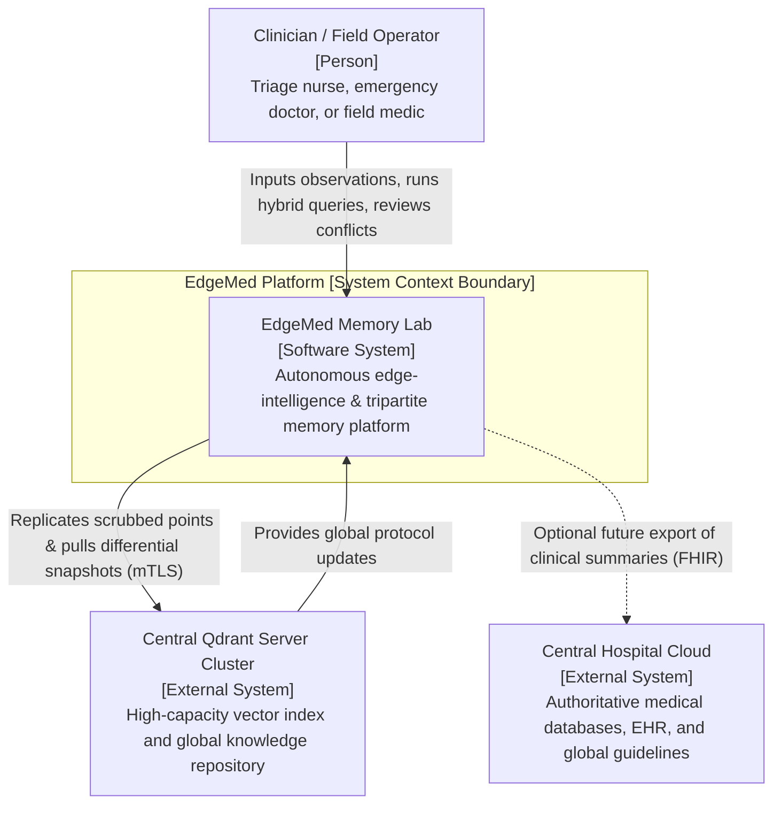

# C4 Model: System Context Specification

- **Document Version:** 1.0.0
- **Status:** Complete / Architecture Reference
- **Date:** 2026-09-26

---

## 1. System Context Diagram

---

## 2. Elements Description

- **User (Clinician / Field Operator):** Uses the EdgeMed interface on portable edge hardware to record triage findings, search medical knowledge, and review clinical contradictions during active field operations.
- **EdgeMed Platform (System):** The complete software system running autonomously on the edge device, providing tripartite memory, memory governance, and synchronization capabilities.
- **Central Qdrant Server Cluster (External System):** High-capacity vector database infrastructure hosted in a central hospital data center, responsible for multi-device snapshot coordination and global vector indexing.
- **Central Hospital Cloud (External System):** Enterprise EHR/HIS infrastructure storing long-term patient records and administrative histories.
