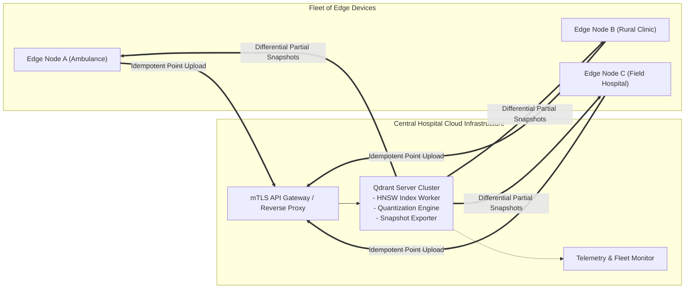

# Cloud Architecture Specification

- **Document Version:** 1.0.0
- **Status:** Complete
- **Date:** 2026-09-26

---

## 1. Role of the Cloud Tier in EdgeMed

The cloud tier is intentionally designed as an **aggregation and optimization hub**, not a hard dependency for edge operation:
- **Central Vector Database:** Standard containerized Qdrant Server instance (listening on ports `6333` and `6334`).
- **Global Medical Knowledge Base:** Hosts broad clinical guidelines, medical textbooks, and cross-clinic anonymized observations.
- **Compute Offloading:** Constructs compute-heavy HNSW graph indices and performs scalar/product quantization on ingested edge points.
- **Snapshot Generation:** Exposes REST endpoints (`/collections/{name}/shards/{id}/snapshot`) to generate full and partial segment snapshots for downstream edge devices.

---

## 2. Cloud Server Topology and Interaction

### Key Cloud Invariants:
1. **Asymmetric Ingestion:** Cloud accepts batch upserts from thousands of edge nodes without blocking.
2. **Segment Sharding Strategy:** Shards are partitioned by facility ID or geographic cluster, allowing edge devices to download only relevant shard subsets.
3. **No Direct Edge Access Required:** Cloud nodes never initiate outbound TCP connections to edge devices (avoiding NAT and firewall traversal issues). Edge devices poll or stream upward via client-initiated mTLS connections.
