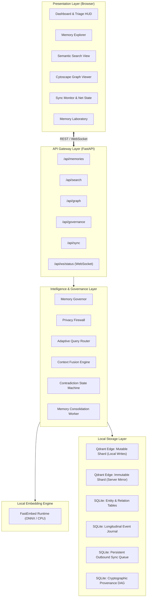

# Component Architecture Specification

- **Document Version:** 1.0.0
- **Status:** Complete
- **Date:** 2026-09-26

---

## 1. Edge Component Topology

The edge platform is structured into distinct, decoupled modular layers within the Python runtime:

---

## 2. Component Responsibilities

1. **`EdgeVectorStore` (`qdrant-edge-py` Wrapper):** Handles instantiation, querying, updating, and snapshot management of the dual-shard configuration.
2. **`KnowledgeGraphStore` (SQLite Driver):** Manages entity nodes and relation edges; provides recursive neighborhood queries and path discovery.
3. **`TemporalEventStore` (SQLite Driver):** Records time-stamped clinical events, progression links, and state transitions.
4. **`MemoryGovernor`:** Runs scoring algorithms to classify memories into `LOCAL`, `SYNC_CANDIDATE`, or `EXPIRE`.
5. **`PrivacyFirewall`:** Evaluates payload fields against privacy rules, redacts PII/PHI, and drops unauthorized sync items.
6. **`QueryRouter`:** Analyzes incoming search requests, checking network state, privacy level, and latency budgets to route to `EDGE`, `CLOUD`, or `HYBRID`.
7. **`SyncReplicator`:** Manages the SQLite-backed outbound queue, network link detection, batch upserts to Qdrant Server, and partial snapshot imports.
