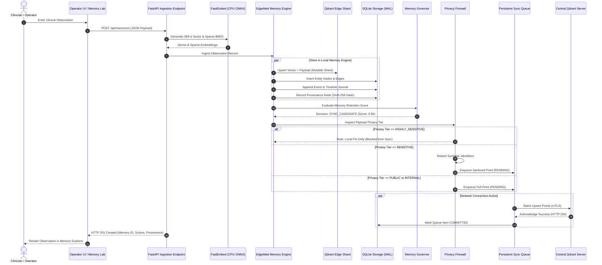

# Data Flow Architecture

- **Document Version:** 1.0.0
- **Status:** Complete
- **Date:** 2026-09-26

---

## 1. End-to-End Clinical Data Flow

The following sequence details how a newly captured clinical observation flows through the EdgeMed system, from operator entry to persistent storage, governance evaluation, and optional cloud synchronization:

---

## 2. Ingestion Stages

1. **Validation & Normalization:** The input JSON is validated against `MemoryCreateRequest` schema; clinical entities are extracted.
2. **On-Device Embedding:** FastEmbed generates 384-dimensional dense vectors and BM25 sparse token frequencies in-process.
3. **Tripartite Persistence:** Points are stored in the Qdrant Edge mutable shard, relational entities in SQLite, and longitudinal events in the timeline journal.
4. **Governance Evaluation:** The Memory Governor calculates relevance, importance, and confidence scores.
5. **Privacy Inspection:** The Privacy Firewall checks sensitivity classifications, drops local-only records, scrubs identifiers, and passes approved payloads to the SQLite outbound queue.
6. **Replication Drain:** An asynchronous background worker transmits queued points to the central Qdrant Server whenever verified network connectivity exists.
