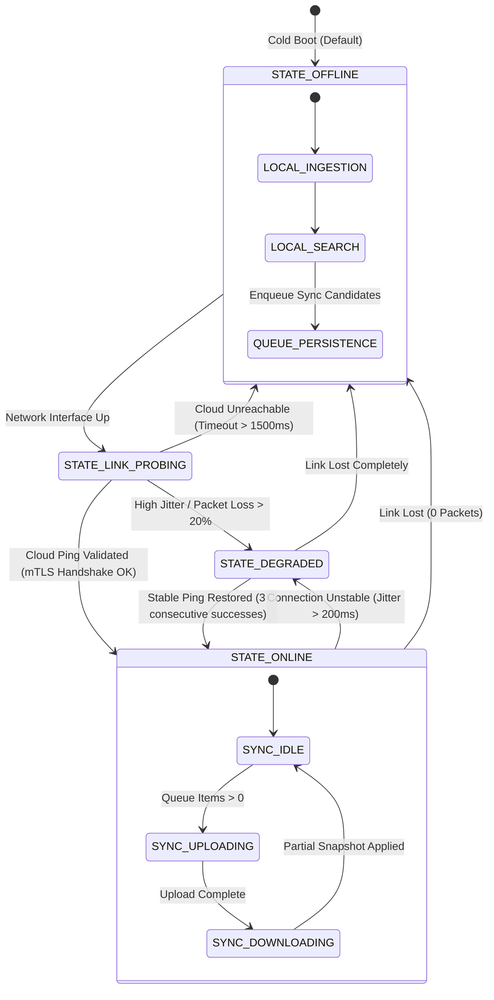

# Offline Architecture and Connectivity State Transitions

- **Document Version:** 1.0.0
- **Status:** Complete / Authoritative Specification
- **Date:** 2026-09-26
- **Lead Architect:** Team LEX (Code Cubicle 6.0 — PS03)

---

## 1. Executive Summary

In EdgeMed, offline operation is not a degraded fallback—it is the foundational design mode. The system guarantees that every local capability (ingestion, vector search, graph navigation, memory governance, and provenance inspection) operates with 100% fidelity without network access.

---

## 2. Global Connectivity State Machine

---

## 3. Systematic Breakdown of All 8 Operational Scenarios

### Scenario 1: Internet is Fully Available
- **System State:** `STATE_ONLINE`
- **Routing:** Query Router enables `HYBRID` search for broad knowledge queries, while maintaining `EDGE` search for acute low-latency lookups.
- **Sync Behavior:** Persistent sync queue drains continuously in micro-batches (10 points per batch). Server snapshot manifest is checked every 5 minutes.
- **UI Indication:** Green status pill: `"ONLINE — SYNCED"`.

### Scenario 2: Internet Becomes Unstable (High Latency / Jitter)
- **System State:** `STATE_DEGRADED`
- **Routing:** Query Router dynamically forces all clinical searches to `EDGE` to avoid clinician wait states. Background sync reduces batch size to 2 points and increases exponential backoff.
- **Sync Behavior:** Upload timeouts are shortened to 1.5s. Failed uploads are marked `FAILED_RETRY` and returned to the queue.
- **UI Indication:** Amber status pill: `"UNSTABLE LINK — LOCAL RETRIEVAL ACTIVE"`.

### Scenario 3: Internet Disappears (Complete Severance)
- **System State:** `STATE_OFFLINE`
- **Routing:** 100% of queries execute against local Qdrant Edge mutable and immutable shards.
- **Sync Behavior:** Outbound sync worker halts network requests immediately. All newly approved memories from the Memory Governor accumulate safely in the persistent SQLite sync queue.
- **UI Indication:** Blue status pill: `"OFFLINE MODE — 100% AUTONOMOUS"`.

### Scenario 4: Internet Returns
- **System State:** `STATE_LINK_PROBING` → `STATE_ONLINE`
- **Sync Behavior:** Connectivity Manager validates cloud endpoint health with a lightweight heartbeat. Once verified, the sync daemon wakes up, checks queue depth, and initiates batch draining.
- **Reconciliation:** Partial snapshot manifest is retrieved from Qdrant Server to pull changes made by peer devices during the disconnection window.
- **UI Indication:** Pulsing blue/green pill: `"RECONNECTED — SYNCHRONIZING QUEUE (N ITEMS)"`.

### Scenario 5: Cloud is Unavailable (Server Outage / 500 Errors)
- **System State:** Treats connection as `STATE_DEGRADED`.
- **Sync Behavior:** Edge device suspends uploads; backs off using exponential jitter (5s, 15s, 45s, max 5m). Local operations continue with zero interruption.
- **UI Indication:** Amber pill: `"CLOUD UNAVAILABLE — LOCAL MEMORY INTACT"`.

### Scenario 6: Local Storage is Nearly Full (> 90% Disk Capacity)
- **System State:** Storage Pressure Emergency.
- **Governor Action:** Memory Governor activates aggressive pruning:
  1. Purges ephemeral search cache and vector query buffers.
  2. Identifies all records marked `EXPIRE` and permanently removes them from SQLite and Qdrant Edge.
  3. Triggers Memory Consolidation to compress clusters of repeated observations.
  4. Never purges records marked `CONFIRMED` or `HIGHLY_SENSITIVE`.
- **UI Indication:** Red warning banner: `"STORAGE PRESSURE (>90%) — GOVERNOR PRUNING ACTIVATED"`.

### Scenario 7: Synchronization Fails Mid-Transfer
- **System State:** Sync Retry Handler.
- **Safety Mechanism:** All uploads are idempotent points upserts keyed by deterministic UUIDv5. A dropped connection mid-batch leaves already committed server points unchanged; unconfirmed points remain in the local SQLite queue for replay upon reconnection. Zero duplicate points created.

### Scenario 8: Conflicting Updates Arrive from Server
- **System State:** Contradiction Detection.
- **Safety Mechanism:** The system compares incoming server timestamps and vector clocks with local uncommitted edits. If an edge clinician modified a patient note while offline and the server brings a conflicting edit:
  1. Neither record is overwritten.
  2. The local record retains operator authority.
  3. The contradiction engine marks both records as `CONFLICTING`.
  4. A notification appears in the Memory Lab prompting clinical review.
