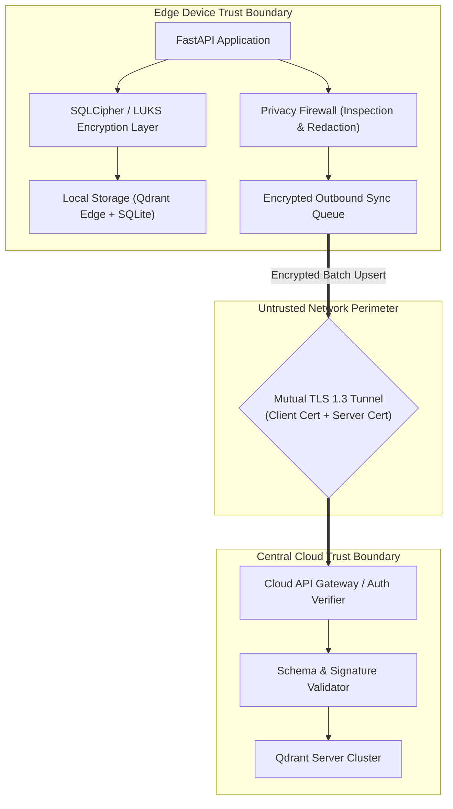

# Security Architecture Specification

- **Document Version:** 1.0.0
- **Status:** Complete
- **Date:** 2026-09-26
- **Lead Security Architect:** Team LEX (Code Cubicle 6.0 — PS03)

---

## 1. Security Architecture Principles

1. **Edge Data Containment:** Assume the edge device may be lost, stolen, or compromised in the field. Data stored on disk must be protected by operating-system and database-level encryption.
2. **Strict Privacy Firewalling:** All outbound network replication must pass through an automated inspection and redaction layer.
3. **Cryptographic Provenance:** Every memory entry and modification must be signed or hashed to guarantee tamper-evidence.
4. **Mutual Authentication (mTLS):** Edge-to-cloud communications require mutual TLS authentication, ensuring only provisioned edge devices can replicate with the hospital cluster.

---

## 2. Security Architecture Diagram

---

## 3. Defense-in-Depth Controls

- **At-Rest Protection:** Local SQLite database and Qdrant Edge directory reside on an encrypted volume (LUKS) or utilize encrypted SQLite backends (SQLCipher) with hardware-backed keys (TPM 2.0 when available).
- **In-Transit Protection:** All sync traffic traverses TLS 1.3 with pinned certificates. Unencrypted HTTP is disabled across all network interfaces (listening strictly on `127.0.0.1` locally).
- **Integrity Verification:** Snapshot downloads from the central Qdrant Server must match signed SHA-256 manifest digests before unpacking into the immutable shard.
