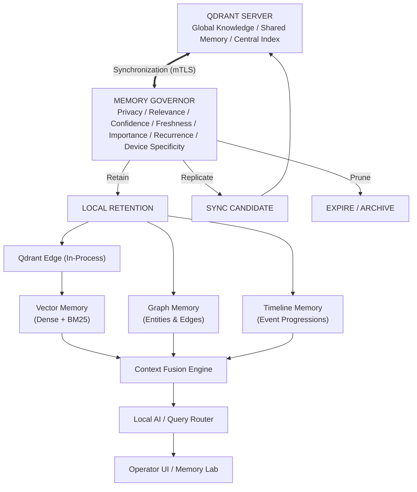

# System Architecture Specification

- **Document Version:** 1.0.0
- **Status:** Complete / Authoritative System Blueprint
- **Date:** 2026-09-26
- **Lead Software Architect:** Team LEX (Code Cubicle 6.0 — PS03)

---

## 1. System Vision & Core Design Principles

The EdgeMed platform is designed around the central architectural principle: **Never make Qdrant responsible for everything.**

Qdrant Edge serves as the local high-speed semantic vector engine. The surrounding platform architecture cleanly separates:
1. **Vector Semantic Memory:** High-speed in-process nearest-neighbor search (Qdrant Edge).
2. **Explicit Knowledge Graph:** Deterministic relational topology and medical ontology (SQLite relational adjacency graph).
3. **Temporal/Event Memory:** Chronological state evolution and longitudinal event sequences (SQLite event journal).
4. **Memory Governance:** Multi-factor retention, scoring, and lifecycle routing (`LOCAL`, `SYNC_CANDIDATE`, `EXPIRE`).
5. **Privacy Policy:** Inline classification and scrubbing barrier (Privacy Firewall).
6. **Query Routing:** Adaptive execution selector (`EDGE`, `CLOUD`, `HYBRID`).
7. **Synchronization:** Asynchronous, persistent queue-based replication and snapshot recovery.
8. **Local AI:** FastEmbed CPU embeddings and context fusion.
9. **User Interface:** Interactive Memory Lab and clinical decision-support HUD.

---

## 2. High-Level Conceptual Architecture

---

## 3. Subsystem Breakdown and Responsibilities

### 3.1 Qdrant Server (Central Cloud/Hospital Node)
The central server acts as the authoritative knowledge repository across all edge nodes:
- Maintains global medical literature, clinical protocols, and cross-device anonymized findings.
- Performs background HNSW index optimization and quantizations.
- Exports partial snapshots partitioned by shard ID for downstream edge replication.

### 3.2 Memory Governor & Privacy Firewall
Acts as the intelligent decision-making layer between raw observations and storage/sync pipelines:
- Computes multi-factor retention scores based on clinical importance, recency, and recurrence.
- Enforces data sovereignty by classifying records into privacy tiers and stripping identifiers from sync payloads.
- Routes records to local persistence, outbound replication queues, or archival pruning.

### 3.3 The Tripartite Storage Layer
- **Qdrant Edge:** In-process directory-backed shard answering vector similarity queries in <1ms.
- **Relational Knowledge Graph:** SQLite-backed tables storing explicit entity-relationship tuples (`Patient -> HasCondition -> Condition`).
- **Temporal Event Timeline:** SQLite-backed append-only event stream tracking symptom evolutions and treatment responses across time.

### 3.4 Context Fusion & Query Intelligence
Combines the disparate memory streams into a cohesive context window for clinical decision support:
- Fuses dense vector scores with sparse BM25 keyword rankings using Reciprocal Rank Fusion (RRF).
- Filters vector candidates against active graph topology (e.g., removing medications contraindicated in the graph).
- Applies temporal decay curves to transient observations while preserving chronic diagnoses.
