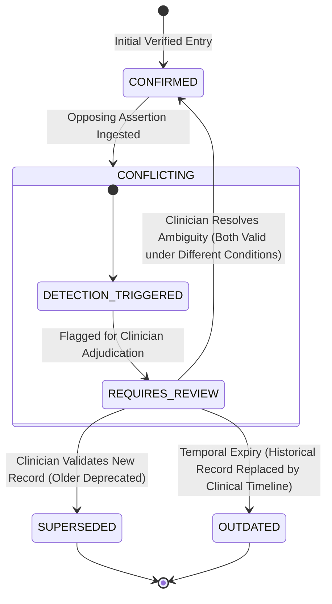

# Contradiction Detection and Resolution Architecture

- **Document Version:** 1.0.0
- **Status:** Complete / Authoritative Specification
- **Date:** 2026-09-26
- **Lead System Designer:** Team LEX (Code Cubicle 6.0 — PS03)

---

## 1. The Danger of Silent Overwrites

Standard databases operate on simple overwrite semantics: when an update arrives for an entity, the existing row is updated in place. In healthcare, this behavior is catastrophic:
- If Clinician A enters *"Penicillin allergy confirmed: severe hives"*, and 2 days later Clinician B enters *"Penicillin allergy test negative, tolerated amoxicillin"*, silently erasing Clinician A's record destroys the rationale for previous clinical decisions and conceals potential clinical hazards.

EdgeMed enforces a non-destructive **Contradiction Lifecycle State Machine**. When contradictory assertions arrive, both records are preserved and contextualized.

---

## 2. The Contradiction Lifecycle State Machine

---

## 3. Contradiction State Definitions

| State | Semantic Meaning | System Behavior |
| :--- | :--- | :--- |
| **`CONFIRMED`** | The memory is active, corroborated, and has no active opposing assertions. | Included in all standard vector queries and graph traversals. |
| **`CONFLICTING`** | An opposing medical assertion has been detected (e.g., conflicting drug therapy, incompatible allergy status). | Both memories are linked via a `CONTRADICTS` graph edge; highlighted in red in the UI; excluded from automated recommendation pathways until reviewed. |
| **`REQUIRES_REVIEW`** | A high-priority alert state requiring human clinician adjudication in the Memory Lab. | Prominently displayed on the operator dashboard with side-by-side evidence comparison. |
| **`SUPERSEDED`** | A newer, higher-authority assertion has replaced this memory (e.g., definitive lab biopsy replacing tentative visual triage). | Excluded from default search results; retained in the background Knowledge Graph for provenance tracking. |
| **`OUTDATED`** | The observation was clinically valid at creation time but has elapsed past its clinical relevance window. | Retained in the historical temporal journal; assigned near-zero weight in current triage queries. |

---

## 4. Contradiction Detection Heuristics

The Contradiction Engine evaluates incoming memories using two cooperating pipelines:
1. **Ontological Contradiction (Graph Rules):** SQLite graph queries check for mutually exclusive edges (e.g., `Patient -> AllergicTo -> Drug` vs. `Patient -> Prescribed -> Drug`, or mutually exclusive disease staging).
2. **Semantic Polarity Negation (NLP / Embedding Rules):** For unstructured notes with high topical cosine similarity ($\text{Sim} \ge 0.82$) but opposing sentiment or negation markers (e.g., "patient denies chest pain" vs. "patient reports acute substernal chest pain"), the engine flags the pair for `REQUIRES_REVIEW`.
