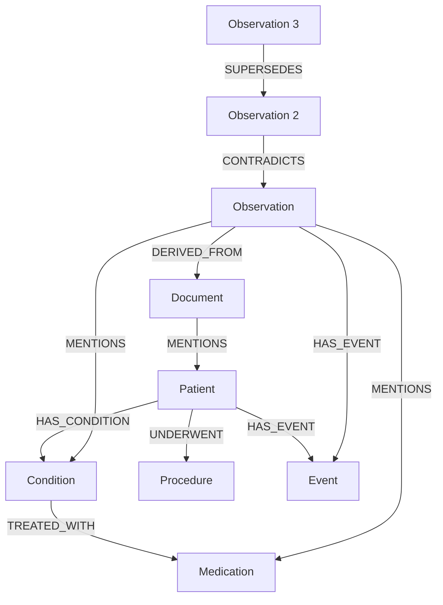

# Knowledge Graph Specification: Explicit Relational Clinical Ontology

- **Document Version:** 1.0.0
- **Status:** Complete / Authoritative Specification
- **Date:** 2026-09-26
- **Lead Knowledge Engineer:** Team LEX (Code Cubicle 6.0 — PS03)

---

## 1. Architectural Mandate: Graph vs. Vector Boundaries

> [!IMPORTANT]
> **Vector similarity is NOT a graph edge.**
> In EdgeMed, high cosine similarity between two vector embeddings does NOT create an edge in the Knowledge Graph.
> Graph edges represent **explicit, verified ontological assertions and causal relationships** derived from structured clinical data, standardized medical taxonomies, or explicit clinician actions.

---

## 2. Clinical Ontology: Node and Edge Definitions



### 2.1 Node Types

| Node Type | Description | Key Attributes |
| :--- | :--- | :--- |
| **`Patient`** | An individual clinical subject (synthetic). | `patient_id`, `pseudonym`, `dob_year`, `gender`, `blood_type` |
| **`Condition`** | A diagnosed pathology or medical state. | `code` (ICD-10 synthetic), `name`, `severity`, `acuity` |
| **`Medication`** | A pharmaceutical agent or therapy. | `rxnorm_code`, `name`, `dosage_form`, `contraindications` |
| **`Procedure`** | A clinical intervention or diagnostic test. | `cpt_code`, `name`, `timestamp`, `status` |
| **`Observation`** | A discrete clinical finding, symptom, or vital. | `observation_id`, `type`, `value`, `unit`, `confidence` |
| **`Event`** | A temporal marker within a patient care timeline. | `event_id`, `event_type`, `timestamp`, `duration_minutes` |
| **`Document`** | A source clinical note, lab report, or scan. | `doc_id`, `doc_type`, `source_hash`, `author_role` |

### 2.2 Edge Types (Explicit Relations)

| Edge Type | Valid Source Nodes | Valid Target Nodes | Semantic Meaning |
| :--- | :--- | :--- | :--- |
| **`HAS_CONDITION`** | `Patient` | `Condition` | Patient is clinically diagnosed with or presents this condition. |
| **`TREATED_WITH`** | `Condition` | `Medication` / `Procedure` | Standard or active therapy prescribed for this condition. |
| **`HAS_EVENT`** | `Patient` / `Observation` | `Event` | Links observations or subject states to a discrete timeline event. |
| **`MENTIONS`** | `Observation` / `Document`| `Condition` / `Medication` / `Patient` | Explicit entity mention within an unstructured text record. |
| **`DERIVED_FROM`** | `Observation` | `Document` / `Observation` | Provenance lineage: observation was extracted from this source. |
| **`CONTRADICTS`** | `Observation` / `Condition`| `Observation` / `Condition` | Explicit medical conflict between two mutually exclusive assertions. |
| **`SUPERSEDES`** | `Observation` / `Condition`| `Observation` / `Condition` | A newer, higher-confidence finding replaces an earlier finding. |

---

## 3. Storage and Querying in SQLite

The Knowledge Graph is stored in relational tables with foreign keys and index optimization:
- `kg_nodes` (`node_id`, `node_type`, `properties_json`, `created_at`)
- `kg_edges` (`edge_id`, `source_id`, `target_id`, `relation_type`, `properties_json`, `weight`, `created_at`)

### Multi-Hop Neighborhood Traversal via Recursive CTE:
```sql
WITH RECURSIVE GraphTraversal AS (
    SELECT source_id, target_id, relation_type, 1 AS depth
    FROM kg_edges
    WHERE source_id = :start_node_id
    UNION ALL
    SELECT e.source_id, e.target_id, e.relation_type, gt.depth + 1
    FROM kg_edges e
    INNER JOIN GraphTraversal gt ON e.source_id = gt.target_id
    WHERE gt.depth < :max_depth
)
SELECT * FROM GraphTraversal;
```
Traversals execute in `<2ms` for neighborhoods up to 3 hops, ensuring zero latency penalty for local clinical rule checks.
