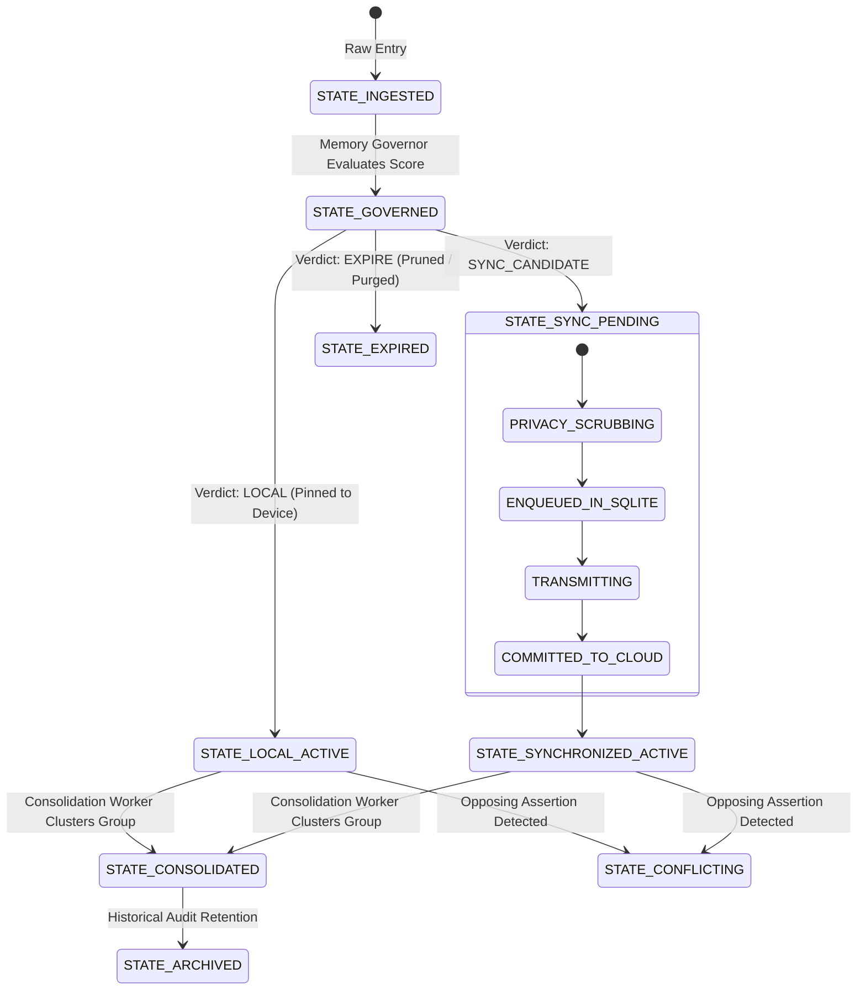

# Memory Lifecycle Specification

- **Document Version:** 1.0.0
- **Status:** Complete
- **Date:** 2026-09-26

---

## 1. The Full Lifecycle State Continuum

A memory record transitions through explicit lifecycle states governed by the Memory Governor, the Privacy Firewall, and the Consolidation Engine:

---

## 2. Transition Triggers and Enforcement

1. **Ingested → Governed:** Triggered synchronously upon POST request completion.
2. **Governed → Local Active:** Occurs when the record is classified as `HIGHLY_SENSITIVE` or has low relevance outside this physical device.
3. **Governed → Sync Pending:** Occurs when the record has high clinical importance, valid confidence, and passes privacy rules.
4. **Active → Conflicting:** Triggered automatically by the Contradiction Engine when an incoming record creates an opposing clinical assertion.
5. **Active → Consolidated:** Triggered by background worker when $N \ge 3$ semantically similar observations occur within a 4-hour window.
6. **Active → Expired:** Triggered during storage pressure when a transient record's freshness score drops below 0.10 and importance is low (<0.20).
