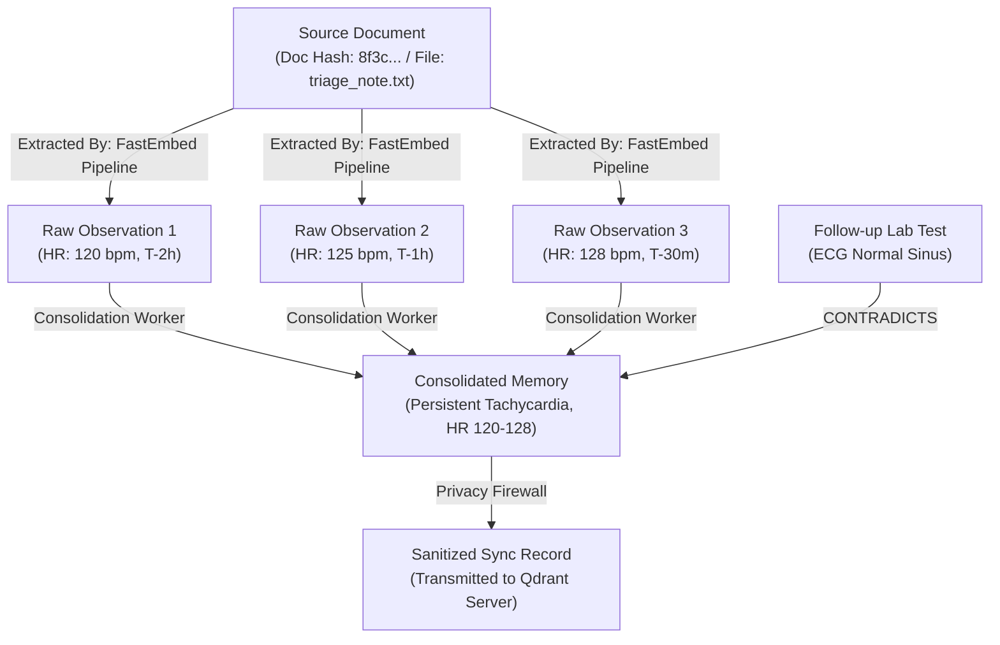

# Memory Provenance Model: Cryptographic Audit Lineage

- **Document Version:** 1.0.0
- **Status:** Complete / Authoritative Specification
- **Date:** 2026-09-26
- **Lead System Designer:** Team LEX (Code Cubicle 6.0 — PS03)

---

## 1. Architectural Motivation for Clinical Provenance

In clinical decision-support systems, a recommendation without origin lineage is dangerous. When a clinician reads that a patient is suspected of sepsis or has an alleged allergy to cephalosporins, they must be able to audit:
- *Where did this statement originate?*
- *When was it created?*
- *What device captured it?*
- *Who or what generated it (clinician, automated lab analyzer, sensor)?*
- *What prior memories contributed to it?*
- *Was it modified, consolidated, synchronized, or superseded?*

---

## 2. The Provenance DAG Model

Provenance in EdgeMed is structured as a Directed Acyclic Graph (DAG) stored in SQLite table `memory_provenance`:

---

## 3. Provenance Record Attributes

Every memory entity maintains an immutable `provenance` record answering the 9 critical audit questions:

| Audit Question | Provenance Field | Example Value | Semantic Meaning |
| :--- | :--- | :--- | :--- |
| **Where did it originate?** | `origin_facility` / `origin_context` | `"Field Clinic Alpha - Triage Bay 2"` | Physical and administrative location. |
| **When was it created?** | `created_at` | `"2026-09-26T14:15:22.408Z"` | High-resolution UTC timestamp. |
| **What generated it?** | `generator_modality` | `"CLINICIAN_ENTRY"` / `"DEVICE_MONITOR"` | Modality and software agent ID. |
| **What contributed to it?** | `parent_memory_ids` | `["mem_101a", "mem_101b"]` | Array of antecedent memory IDs. |
| **Was it modified?** | `revision_history` | `[{rev: 1, modified_at: ...}]` | Append-only delta log of changes. |
| **Was it synchronized?** | `sync_records` | `[{server: "qdrant_cloud_01", ...}]` | Server sync timestamp and batch ID. |
| **Which device created it?** | `origin_device_id` | `"edge_node_ryzen5_042"` | Physical hardware identifier. |
| **Was it consolidated?** | `is_consolidated` / `consolidation_id` | `true`, `"cons_994a"` | Flag and link to consolidated summary. |
| **Was it superseded?** | `superseded_by_id` | `"mem_205c"` | Link to newer authoritative record. |
