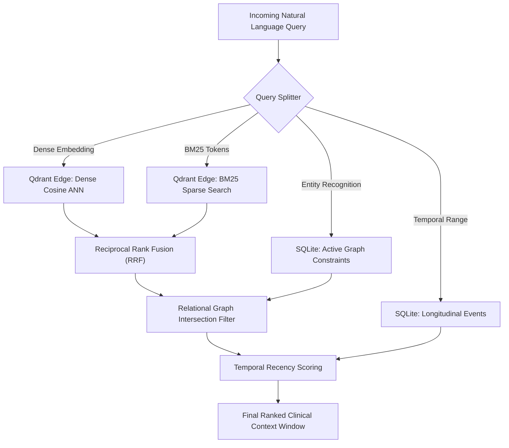

# Context Fusion Specification: Hybrid Retrieval & Multi-Pillar Ranking

- **Document Version:** 1.0.0
- **Status:** Complete / Technical Architecture
- **Date:** 2026-09-26
- **Lead Research Engineer:** Team LEX (Code Cubicle 6.0 — PS03)

---

## 1. Multi-Stage Fusion Pipeline

The Context Fusion engine merges results across the Tripartite Memory pillars:

---

## 2. Reciprocal Rank Fusion (RRF) Formulation

When querying Qdrant Edge, dense similarity and sparse BM25 scores have different scale distributions. EdgeMed uses Reciprocal Rank Fusion to synthesize ranks without unstable score calibration:

$$RRF(d) = \sum_{m \in \{dense, sparse\}} \frac{1}{k + r_m(d)}$$

Where:
- $r_m(d)$ is the rank of document $d$ within retrieval modality $m$.
- $k$ is the smoothing constant (default: $k = 60$).

---

## 3. Relational Intersection Filtering

Candidate documents retrieved from vector search are evaluated against the SQLite Knowledge Graph:
1. **Contraindication Pruning:** If a retrieved treatment document $d$ mentions a drug $X$, and the graph contains an active edge `Patient -> Contraindicates -> Drug(X)`, the document is either filtered out completely or assigned a severe negative penalty ($\times 0.05$) and flagged with a clinical warning.
2. **Entity Affirmation:** If a document discusses a confirmed active condition (`Patient -> HasCondition -> C`), its relevance is boosted ($\times 1.25$).
