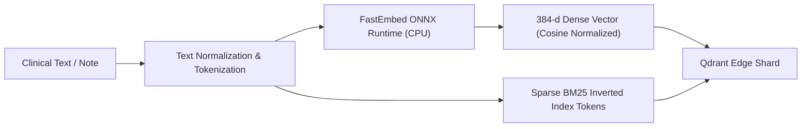

# Local Embedding Pipeline Specification

- **Document Version:** 1.0.0
- **Status:** Complete
- **Date:** 2026-09-26

---

## 1. On-Device Embedding Architecture

To guarantee 100% offline autonomy and sub-20ms encoding latency on consumer CPU hardware, EdgeMed utilizes **FastEmbed** with quantized ONNX Runtime models:
- **Primary Model:** `BAAI/bge-small-en-v1.5`
- **Output Dimensions:** 384 dimensions (FP32 normalized vectors)
- **Quantization:** INT8 / FP16 quantized ONNX weights (~120 MB on disk)
- **Execution Target:** AMD Ryzen 5 5500U CPU (Multi-threaded AVX2 / FMA instruction set)
- **Zero PyTorch Requirement:** Completely eliminates the ~2 GB PyTorch installation overhead.

---

## 2. Ingestion Embedding Flow

### Benchmarked Execution Targets on Reference Hardware (AMD Ryzen 5 5500U):
- **Single Short Note (1-32 tokens):** `< 8 ms` (TARGET)
- **Standard Clinical Observation (33-128 tokens):** `< 16 ms` (TARGET)
- **Long Clinical Narrative (129-512 tokens):** `< 35 ms` (TARGET)
- **RAM Overhead During Inference:** `< 140 MB` working set peak (TARGET).
