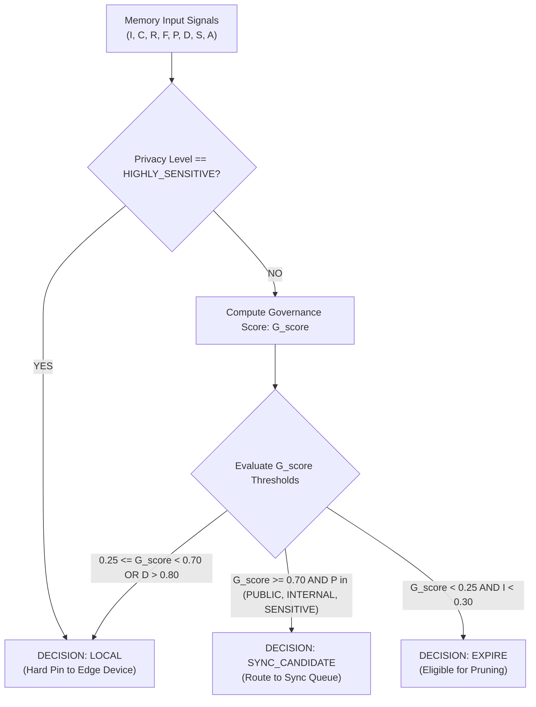

# Memory Governor Specification: Retention, Lifecycle, and Routing Engine

- **Document Version:** 1.0.0
- **Status:** Complete / Proposed Algorithm
- **Date:** 2026-09-26
- **Lead Architect:** Team LEX (Code Cubicle 6.0 — PS03)

---

## 1. Executive Summary and Role

The **Memory Governor** is the central lifecycle arbiter of EdgeMed. Edge storage and cellular sync bandwidth are strictly finite. The Memory Governor continuously inspects incoming and existing memories to assign one of three operational lifecycle verdicts:
- **`LOCAL`:** The memory is retained on the edge device for local retrieval but withheld from cloud synchronization.
- **`SYNC_CANDIDATE`:** The memory possesses high global relevance, passes privacy criteria, and is approved for transmission to the central Qdrant Server.
- **`EXPIRE`:** The memory has aged beyond its clinical utility, has low importance, or represents transient noise, and is scheduled for local eviction/archival.

---

## 2. Multi-Signal Governance Evaluation Model

> [!WARNING]
> ### PROPOSED ALGORITHM NOTICE
> The mathematical formulations presented in this document represent the **PROPOSED ALGORITHM** for evaluation during Phase 7. The exact weighting coefficients are heuristic hypotheses and have **NOT** yet been empirically validated on production clinical telemetry.

### Evaluated Signals

| Signal Name | Symbol | Range | Description |
| :--- | :--- | :--- | :--- |
| **Clinical Importance** | $I$ | $[0.0, 1.0]$ | Acuity and patient danger (e.g., Anaphylaxis = 1.0; Normal temp = 0.2). |
| **Observation Confidence** | $C$ | $[0.0, 1.0]$ | Measurement reliability (e.g., Certified lab = 0.98; tentative note = 0.60). |
| **Recurrence Count** | $R$ | $\mathbb{Z}_{\ge 1}$ | Number of times this finding has been observed or confirmed. |
| **Freshness (Recency)** | $F$ | $[0.0, 1.0]$ | Exponential decay based on time elapsed since capture ($e^{-\lambda \Delta t}$). |
| **Privacy Classification** | $P$ | Categorical | `PUBLIC` (0), `INTERNAL` (1), `SENSITIVE` (2), `HIGHLY_SENSITIVE` (3). |
| **Device Specificity** | $D$ | $[0.0, 1.0]$ | Degree to which data is relevant only to this physical hardware node. |
| **Storage Pressure** | $S$ | $[0.0, 1.0]$ | Fraction of local disk capacity currently occupied. |
| **Access Frequency** | $A$ | $\mathbb{Z}_{\ge 0}$ | Number of times this memory was retrieved by clinical searches. |

---

## 3. Proposed Governance Algorithm



### Proposed Scoring Equation:

$$G_{\text{score}} = w_1 I + w_2 C + w_3 \log_2(1 + R) + w_4 F + w_5 \log_2(1 + A) - w_6 D$$

*Initial Proposed Heuristic Weights:*
- $w_1 = 0.35$ (Importance dominates retention)
- $w_2 = 0.20$ (Confidence)
- $w_3 = 0.15$ (Recurrence)
- $w_4 = 0.15$ (Freshness)
- $w_5 = 0.10$ (Access frequency)
- $w_6 = 0.25$ (High device specificity penalizes global sync)

---

## 4. Failure Modes and Safety Boundaries

1. **Failure Mode: Accidental Eviction of Critical Inactive Records**
   - *Risk:* A patient has a life-threatening latex allergy recorded 3 years ago. Freshness ($F$) has decayed to near zero, and access frequency ($A$) is low.
   - *Mitigation:* Hard Invariant: If $I \ge 0.85$, the Governor can **never** output `EXPIRE`, regardless of $F$, $S$, or $A$.
2. **Failure Mode: Cloud Flood during Sudden Reconnection**
   - *Risk:* Edge generates 10,000 raw vitals while offline; all are marked `SYNC_CANDIDATE`.
   - *Mitigation:* Governor requires Consolidation Worker execution prior to sync; only consolidated patterns ($R \ge 3$) are permitted upstream.

---

## 5. Explainability Breakdown in UI

Every governance decision outputs a transparent, audit-ready explanation payload:
```json
{
  "memory_id": "mem_4a5b6c7d",
  "decision": "LOCAL",
  "governance_score": 0.584,
  "factors": {
    "importance": 0.40,
    "confidence": 0.90,
    "freshness": 0.95,
    "recurrence": 1,
    "device_specificity": 0.85
  },
  "primary_reason": "Device specificity (0.85) exceeds cloud relevance threshold; observation pinned locally."
}
```
