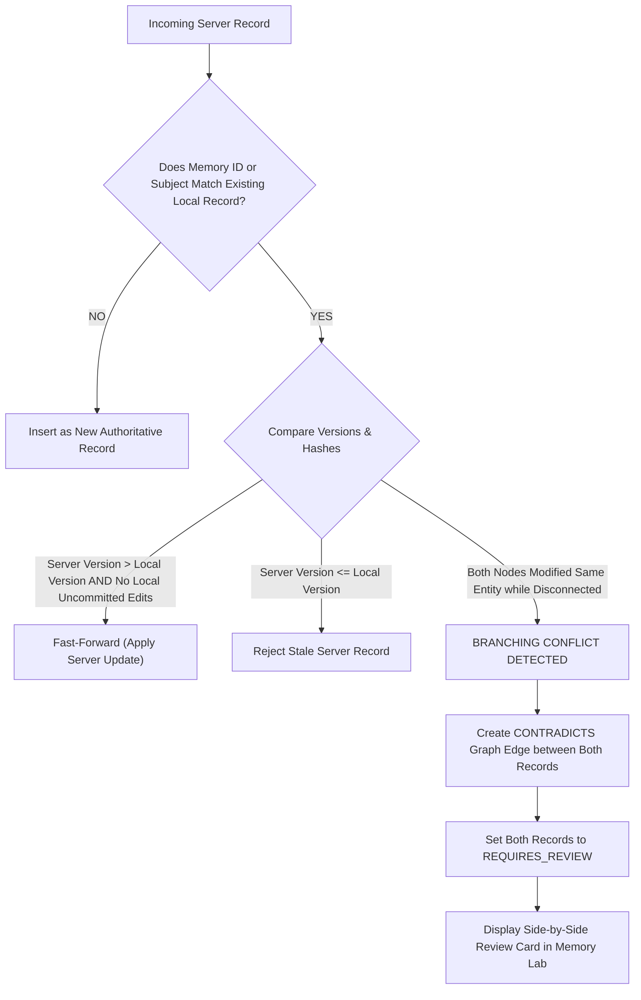

# Conflict Resolution Specification: Multi-Master Reconciliations

- **Document Version:** 1.0.0
- **Status:** Complete / Technical Architecture
- **Date:** 2026-09-26
- **Lead Distributed Systems Engineer:** Team LEX (Code Cubicle 6.0 — PS03)

---

## 1. Conflict Classification: Updates vs. Contradictions

In distributed edge systems, data diverges when two edge nodes modify the same patient profile while disconnected. EdgeMed categorizes divergent states into two distinct types:
1. **Benign Non-Overlapping Updates:** Node A adds a blood pressure reading; Node B adds a respiratory rate reading. These are merged additively with zero conflict.
2. **True Medical Contradictions:** Node A records "Patient diagnosed with bacterial pneumonia, initiate Azithromycin"; Node B records "Sputum culture negative, viral etiology confirmed, discontinue antibiotics".

---

## 2. Multi-Master Resolution Protocol

---

## 3. Human-in-the-Loop Clinician Adjudication

> [!IMPORTANT]
> **Zero Autonomous Deletions in Conflicted States.**
> When a medical conflict occurs, EdgeMed never guesses which clinician was "correct" using automated heuristics. Both observations are preserved in the system with full provenance attribution until an authorized clinician adjudicates the conflict in the **Memory Lab**.

### Adjudication Options Available to Clinician in UI:
1. **Accept New Record (Supersede):** The clinician marks the newer record as authoritative; the older record transitions to `SUPERSEDED`.
2. **Retain Prior Record (Refute):** The incoming server record is rejected or marked as `INVALIDATED_BY_CLINICIAN`.
3. **Coexist as Conditional Variants:** Both records are retained as valid under different contextual conditions (e.g., "Allergy present in childhood, outgrown in adulthood").
