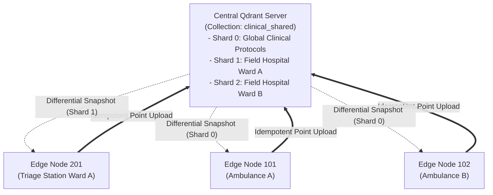

# Multi-Device Synchronization Specification

- **Document Version:** 1.0.0
- **Status:** Complete
- **Date:** 2026-09-26

---

## 1. Hub-and-Spoke Sharded Topology

EdgeMed adopts a **Hub-and-Spoke Tiered Sharding Architecture** for multi-device fleet deployments:
- Direct ad-hoc peer-to-peer mesh synchronization between mobile edge devices is intentionally avoided due to security perimeter fragmentation, NAT traversal fragility, and unstable vector clock topologies.
- All inter-device knowledge propagation passes through the centralized **Qdrant Server** hub via partitioned snapshot shards.

---

## 2. Cross-Device Propagation Lifecycle

1. **Local Observation on Device 101:** Ambulance paramedic records patient vital signs and initial stabilization notes while in transit (offline).
2. **Uplink to Cloud Hub:** Ambulance arrives within hospital Wi-Fi range. Device 101 connects and drains its outbound sync queue to Qdrant Server.
3. **Server HNSW Indexing:** Central Qdrant Server incorporates points into Shard 1, updates the HNSW graph index, and updates its snapshot manifest.
4. **Downlink to Device 201:** The ER Triage Station (Device 201) detects an updated server manifest for Shard 1, downloads the differential segment delta, and loads the patient's incoming vitals and treatment history before the patient physically enters the triage bay.
