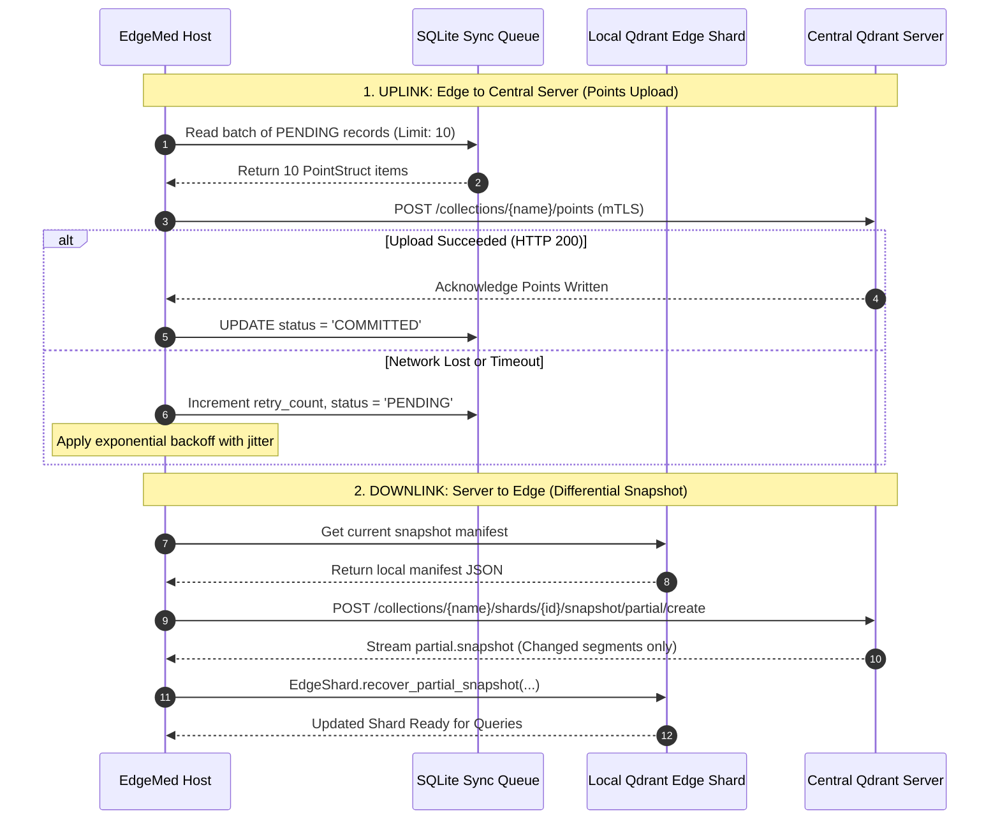

# Synchronization Protocol Specification

- **Document Version:** 1.0.0
- **Status:** Complete / Authoritative Protocol Specification
- **Date:** 2026-09-26
- **Lead Distributed Systems Engineer:** Team LEX (Code Cubicle 6.0 — PS03)

---

## 1. Protocol Architecture and Upstream Boundaries

The synchronization protocol coordinates state between disconnected edge devices and the central hospital Qdrant Server cluster.

### Clear Technology Division of Labor:
- **Upstream Qdrant Primitives:**
  - `EdgeShard.unpack_snapshot(path, dir)`: Restores a server snapshot into local disk structures.
  - `EdgeShard.snapshot_manifest()`: Generates local segment manifest hashes for differential comparison.
  - `EdgeShard.recover_partial_snapshot(...)`: Ingests differential segment delta files.
  - `qdrant_client.upsert(...)`: Transmits point vectors and payloads to server collections.
- **EdgeMed Application Layer (Our Code):**
  - Persistent SQLite transaction queue with retry backoff.
  - Network state monitor and heartbeat probe.
  - Multi-master conflict detection and contradiction state engine.
  - Differential snapshot scheduling and segment file integrity checking.
  - Privacy Firewall integration.

---

## 2. Bidirectional Synchronization Mechanics

---

## 3. Protocol Invariants: Idempotency and Versioning

1. **Idempotency Guarantee:** All point IDs are deterministic UUIDv5 hashes derived from namespace and origin content. Re-uploading the same point $N$ times produces the identical vector and payload state on the server without duplicate accumulation.
2. **Monotonic Versioning:** Every memory record maintains an integer `version` field. When an update is pushed, the version is incremented. The server and peer devices reject incoming updates whose version is less than or equal to the currently stored version, preventing stale re-writes.
3. **Partial Snapshot Efficiency:** Downlink replication downloads only the modified binary segments rather than the full multi-gigabyte collection snapshot, cutting transfer sizes by over 90% across bandwidth-constrained field links.
