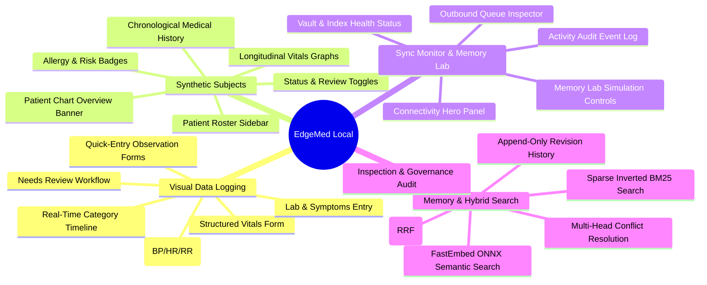

# EdgeMed Features & Workspace Guide

**Product Version:** 1.0.0 (Research Prototype)  
**Target Environment:** Local Edge Server & Private Hospital LAN  
**Themes:** Catppuccin Latte (Light) & Catppuccin Mocha (Dark)  
**Safety Notice:** Synthetic Care Records Only · Not for Clinical Use  

---

## 1. Feature Map & Navigation Overview

EdgeMed organizes clinical memory capture, patient longitudinal review, synchronization monitoring, and hybrid retrieval into four dedicated workspaces accessible via the top navigation bar or mobile drawer:



---

## 2. Workspace 1: Visual Data Logging & Monitoring

The Visual Data Logging workspace (`frontend/src/logging.tsx`, `quick-entry.tsx`, `charts.tsx`) allows clinicians to rapidly enter structured medical observations, monitor trends over time, and resolve unreviewed findings without navigating multiple complex screens.

```
+---------------------------------------------------------------------------------------------------+
|  VISUAL DATA LOGGING & MONITORING                                                                  |
|                                                                                                   |
|  +--------------------+  +--------------------+  +--------------------+  +---------------------+  |
|  | [♥] Vitals Entry   |  | [🧪] Lab Values    |  | [!] Symptoms       |  | [📝] Clinical Note  |  |
|  | BP: 120/80 mmHg    |  | Glucose: 95 mg/dL  |  | Cough, Fever       |  | Free-text narrative |  |
|  | HR: 72 bpm, SpO2   |  | Sodium, Potassium  |  | Severity: Moderate |  | Privacy: Sensitive  |  |
|  | [ Save Vitals ]    |  | [ Save Lab Value ] |  | [ Record Symptom ] |  | [ Save Observation ]|  |
|  +--------------------+  +--------------------+  +--------------------+  +---------------------+  |
|                                                                                                   |
|  +---------------------------------------------------------------------------------------------+  |
|  | VITALS TREND MONITOR (Interactive SVG Visualizations)                                       |  |
|  | - Systolic / Diastolic Blood Pressure Tracking (mmHg)                                       |  |
|  | - Heart Rate (bpm) with normal baseline reference                                           |  |
|  | - Respiratory Rate (breaths/min) & Temperature trendlines                                   |  |
|  +---------------------------------------------------------------------------------------------+  |
|                                                                                                   |
|  +---------------------------------------------------+  +---------------------------------------+  |
|  | REAL-TIME OBSERVATION TIMELINE                    |  | NEEDS REVIEW QUEUE                    |  |
|  | Filters: [All] [Vitals] [Lab] [Allergy] [Notes]  |  | Unreviewed observations requiring     |  |
|  | - 14:30 SYN-001 BP: 124/82 mmHg [Reviewed]        |  | clinical validation:                  |  |
|  | - 14:15 SYN-002 Penicillin Allergy [Critical]     |  | - SYN-001 Fever (Awaiting Review)    |  |
|  | - 13:50 SYN-001 Cough and elevated temperature    |  | - SYN-003 Potassium Reading           |  |
|  +---------------------------------------------------+  +---------------------------------------+  |
+---------------------------------------------------------------------------------------------------+
```

### Key Capabilities
* **Quick-Entry Form Cards:**
  * **Vitals:** Systolic/Diastolic blood pressure, Heart rate, Respiratory rate, Body temperature, SpO2.
  * **Lab Values:** Blood Glucose, Potassium, Sodium, Hemoglobin, WBC count with reference ranges.
  * **Symptoms:** Structured symptom selection (Fever, Cough, Dyspnea, Fatigue, Pain) with severity ratings.
  * **Clinical Notes:** Free-text clinical narrative with subject ID linkage and privacy tier selector (`SENSITIVE` vs. `HIGHLY_SENSITIVE`).
* **Interactive Trend Charts:** Pure SVG charts derived directly from canonical SQLCipher records, plotting systolic/diastolic BP, pulse rate, and temperature over time without heavy external charting libraries.
* **Needs Review Workflow:** Automatically highlights unverified observations, allowing clinicians to review, revise, or acknowledge findings with one click.

---

## 3. Workspace 2: Synthetic Subjects / Patient Roster

The Synthetic Subjects workspace (`frontend/src/subjects.tsx`) organizes observations around patient entities (e.g., `SYN-001`, `SYN-002`, `SYN-003`).

```
+---------------------------------------------------------------------------------------------------+
|  SYNTHETIC SUBJECTS / PATIENT ROSTER                                                              |
|                                                                                                   |
|  [Search Subjects...]  | PATIENT CHART: SYN-001 (Adult Synthetic Profile)                         |
|  +------------------+  | Status: Active Observation · Ward: ward-a · Records: 8 · Needs Review: 1 |
|  | SYN-001 (Active) |  +-----------------------------------------------------------------------+  |
|  | 8 records        |  | ALLERGIES & ALERTS: [!] Penicillin (Severe) · [i] High Fall Risk      |
|  +------------------+  +-----------------------------------------------------------------------+  |
|  | SYN-002 (Active) |  | Tabs: [Overview] [Vitals Trend] [Allergies] [Medications] [Timeline]  |
|  | 4 records        |  |                                                                       |
|  +------------------+  | LONGITUDINAL VITALS OVER TIME                                         |
|  | SYN-003 (Stable) |  |   140 |----*----------*--------*---- (Systolic Target < 130)          |
|  | 3 records        |  |   100 |-------*----------*--------*-                                  |
|  +------------------+  |    80 |----------*----------*------- (Diastolic Target < 80)          |
|                        |                                                                       |
|                        | CHRONOLOGICAL MEDICAL HISTORY                                         |
|                        | - Sep 30, 14:30: Routine vitals recorded (BP: 122/80, HR: 74)         |
|                        | - Sep 30, 13:50: Observation note: mild persistent dry cough          |
|                        | - Sep 29, 09:15: Initial triage admission observation                 |
+---------------------------------------------------------------------------------------------------+
```

### Key Capabilities
* **Roster Sidebar:** Fast search and filtering by Subject ID, activity status, or pending review counts.
* **Patient Chart Banner:** Consolidated overview displaying total observations, latest recorded activity, active risk alerts, and review state.
* **Longitudinal Vitals Graphs:** Multi-point timeline plotting historical vital trends for the selected subject.
* **Allergy & Risk Badges:** Highlights critical allergies (e.g., Penicillin, Latex) and risk flags with prominent visual warnings.
* **Subject-Scoped Search:** Quickly filter the subject's entire chronological history using keyword queries.

---

## 4. Workspace 3: Sync Monitor & Memory Lab

The Sync Monitor & Memory Lab workspace (`frontend/src/sync-monitor.tsx`) provides complete transparency into synchronization status, transport queues, storage health, and network simulation.

```
+---------------------------------------------------------------------------------------------------+
|  SYNC MONITOR & MEMORY LAB                                                                        |
|                                                                                                   |
|  +---------------------------------------------------------------------------------------------+  |
|  | CONNECTIVITY HERO                                                                           |  |
|  | Status: [ CONNECTED ] · Device ID: edge-a · Last Contact: 4 seconds ago                     |  |
|  | Gateway: https://127.0.0.1:9443 · Policy: Reviewed Synthetic References Only (PUBLIC)       |  |
|  | Transport Controls: [ Pause Sync ] [ Sync Now ] [ Fetch Reference Snapshot ]               |  |
|  +---------------------------------------------------------------------------------------------+  |
|                                                                                                   |
|  +---------------------------------------------------+  +---------------------------------------+  |
|  | OUTBOUND DELIVERY QUEUE                          |  | STORAGE & VAULT STATUS                |  |
|  | Filter: [All] [Pending: 0] [Acknowledged: 2]     |  | - Canonical DB: SQLCipher (AES-256)   |  |
|  | - Op: 8a4b... Reference: Hydration (v0) -> [ACK]  |  | - Encryption Vault: [ Verified ]      |  |
|  | - Op: 1c9d... Reference: Handoff (v1)   -> [ACK]  |  | - Vector Shard: Qdrant Edge (384-d)   |  |
|  | Invariant: Clinical notes strictly 0 in queue     |  | - Lexical Index: 10,000+ records OK   |  |
|  +---------------------------------------------------+  +---------------------------------------+  |
|                                                                                                   |
|  +---------------------------------------------------------------------------------------------+  |
|  | MEMORY LAB SIMULATION CONTROLS (Admin Testing Only)                                          |  |
|  | Latency Injection: [ 100ms ] · Packet Loss: [ 0% ] · Offline Mode: [ Toggle ]               |  |
|  | Concurrent Branch Simulation: [ Generate Conflict ] [ Reset State ]                         |  |
|  +---------------------------------------------------------------------------------------------+  |
+---------------------------------------------------------------------------------------------------+
```

### Key Capabilities
* **Connectivity Hero:** Displays real-time transport status (`connected`, `paused`, `stale`, `attention`, `unavailable`), device identity, and timestamp of last synchronization.
* **Outbound Queue Inspector:** Granular inspection of synchronization envelopes with state filter chips (`pending`, `retry_wait`, `failed`, `cancelled`, `acknowledged`).
* **Egress Policy Visibility:** Displays the approved-reference sharing rule and queue status. The UI is not an independent proof that no sensitive record can leave the server.
* **Activity Audit Event Timeline:** Searchable feed of chronological system events cryptographically chained via HMAC-SHA256.
* **Memory Lab Simulator:** Interactive controls for simulating network partitions, intermittent connectivity, and concurrent multi-head merge conflicts.

---

## 5. Workspace 4: Memory & Hybrid Search Engine

The Core Memory workspace (`frontend/src/main.tsx`) provides low-latency hybrid search across the local care corpus.

```
+---------------------------------------------------------------------------------------------------+
|  MEMORY & RETRIEVAL WORKSPACE                                                                     |
|                                                                                                   |
|  [ Search care notes, vitals, observations... (Ctrl+K)           ] [ Mode: Hybrid ▾ ] [ Search ]  |
|                                                                                                   |
|  +---------------------------------------------------------------------------------------------+  |
|  | [!] CONFLICT DETECTED: 1 record has concurrent diverging branches. [ Review & Resolve ]     |  |
|  +---------------------------------------------------------------------------------------------+  |
|                                                                                                   |
|  SEARCH RESULTS (Route: LOCAL · Latency: 6.4 ms · Model: BAAI/bge-small-en-v1.5)                 |
|  +---------------------------------------------------------------------------------------------+  |
|  | Persistent cough and fever · SYN-001 · OBSERVATION · Importance: 0.70                      |  |
|  | "Synthetic patient SYN-001 reports persistent dry cough and elevated temperature for..."    |  |
|  | [ Inspect ] [ Revise ] [ View History ] · Matched by: Hybrid RRF Fusion                     |  |
|  +---------------------------------------------------------------------------------------------+  |
|  | Hydration observation checklist · Shared Reference · REFERENCE · Importance: 0.70           |  |
|  | "Synthetic training reference: record oral intake, temperature, and reported dizziness..."   |  |
|  | [ Inspect ] [ Select Variant ] · Release Status: ELIGIBLE                                   |  |
|  +---------------------------------------------------------------------------------------------+  |
+---------------------------------------------------------------------------------------------------+
```

### Key Capabilities
* **Local Hybrid Search:** Combines dense vector cosine similarity (FastEmbed ONNX) and sparse inverted posting scores (SQLite BM25) using Reciprocal Rank Fusion ($k=60$). The [committed Windows synthetic benchmark](scaling-benchmark-results.json) measured 8.46 ms warm p50 at 1,000 records and 63.98 ms at 10,000; this is not a universal latency guarantee.
* **Current-Head Authorization:** Enforces canonical SQLCipher verification on candidate results; deleted records return 404 and leave no search traces.
* **Revision History & Conflict Resolution:** Complete audit history for every memory. If concurrent offline edits create multiple active heads, a warning banner prompts the administrator to execute a three-way branch resolution.

---

## 6. Global Features, Accessibility & Themes

* **Theme Switching:** Instant toggle between Catppuccin Latte (light mode) and Catppuccin Mocha (dark mode) without page reload.
* **Keyboard Shortcuts Modal:** Press `?` to open the shortcuts cheat sheet:
  * `Ctrl + K`: Jump to search bar.
  * `N`: Open quick add observation modal.
  * `1` - `4`: Switch between workspaces.
  * `Escape`: Dismiss open dialogs and drawers.
* **Mobile Responsive Drawer:** Slide-over navigation drawer providing full access to all four workspaces on mobile screens down to 320px width.
