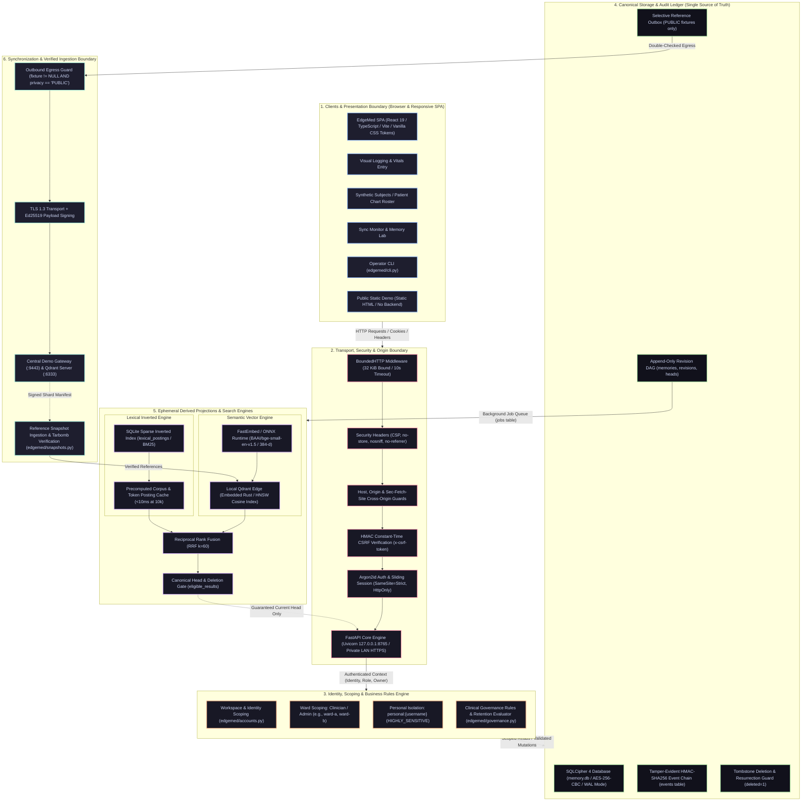
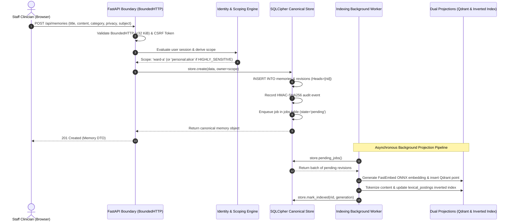
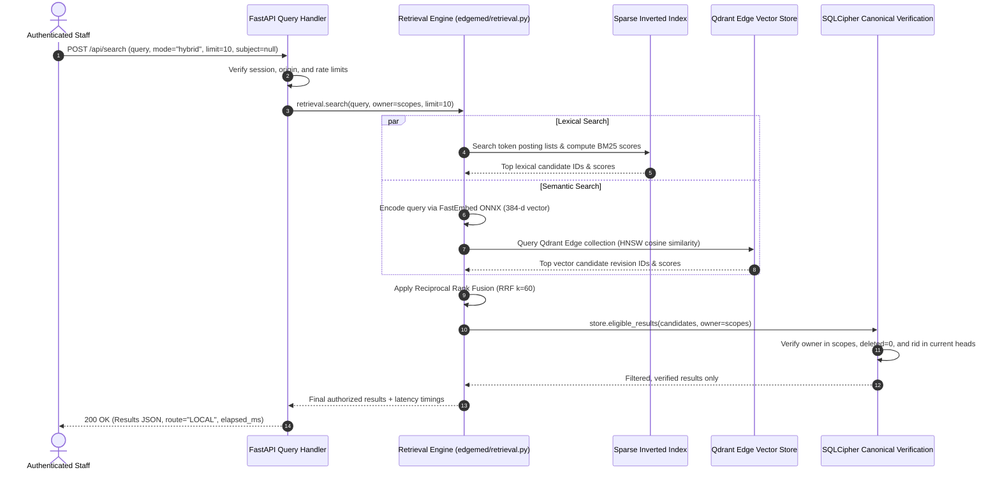

# EdgeMed System Architecture Blueprint & Layer Flow

**Specification Version:** 1.0.0 (Research Prototype)  
**Security Status:** Synthetic Data Only · Not for Clinical Use  
**Canonical Storage Engine:** SQLCipher 4 (AES-256-CBC)  
**Vector & Lexical Engines:** Qdrant Edge (384-d Cosine) & SQLite Sparse Postings (BM25-style)  

---

## 1. High-Level Architectural Blueprint

EdgeMed is architected around strict separation of concerns, zero-cloud dependency, local-first canonical persistence, append-only revision DAGs, and dual-projection retrieval engines.

---

## 2. Detailed Layer Specifications

### Layer 1: Presentation & Client Boundary
The client layer consists of two distinct components:
1. **EdgeMed Authenticated SPA:** Built with React 19, TypeScript, Vite, and semantic vanilla CSS tokens (Catppuccin Latte/Mocha themes). Zero external CDN dependencies; all scripts, fonts, and assets are hosted locally on the EdgeMed ASGI server.
   * **Visual Data Logging Workspace (`logging.tsx`):** Quick-entry cards for vitals, observations, lab values, and clinical notes; interactive SVG trend charts; Needs Review queue.
   * **Synthetic Subjects Roster (`subjects.tsx`):** Patient-chart interface with roster navigation, longitudinal vitals graphs, allergy badge alerts, and chronological history.
   * **Sync Monitor & Memory Lab (`sync-monitor.tsx`):** Connectivity hero status, outbox inspection, audit event timeline, storage diagnostics, and simulation controls.
2. **Public Static Demonstration (`demo.tsx`):** A lightweight standalone sample compiled to static HTML/CSS. It has **no backend, no API, no persistent storage, and no vault**. Notes entered exist strictly in browser tab memory.

### Layer 2: Transport & HTTP Security Boundary
* **Bounded Request Ingestion (`http_boundary.py`):** The `BoundedHTTP` middleware intercepts raw ASGI streams, strictly rejecting payloads exceeding 32,768 bytes (`413 Request Too Large`) and requests taking longer than 10 seconds (`408 Request Timeout`).
* **Origin & Host Protection:** Evaluates incoming `Host` and `Origin` headers against the server's configured origin (`127.0.0.1:8765` or explicit private LAN IP). Drops cross-site requests (`Sec-Fetch-Site: cross-site`) with `403 Forbidden`.
* **State & CSRF Verification:** Issues high-entropy, cryptographically random session tokens (`secrets.token_urlsafe(32)`). Sets `SameSite=Strict`, `HttpOnly`, `Secure` (over HTTPS) cookies. State-modifying HTTP verbs (`POST`, `DELETE`, `PUT`) require a matching `x-csrf-token` verified via `hmac.compare_digest`.
* **Strict Security Headers:** Injects `Cache-Control: no-store`, `X-Content-Type-Options: nosniff`, `Referrer-Policy: no-referrer`, and a hardened `Content-Security-Policy` (`frame-ancestors 'none'`, `default-src 'self'`).

### Layer 3: Identity & Multi-Workspace Scoping Boundary
* **Identity Management (`accounts.py`):** Local user accounts are secured with Argon2id password hashing (`time_cost=3`, `memory_cost=65536` KiB, `parallelism=2`). Brute-force rate limiting blocks IPs after 8 failed attempts in 5 minutes.
* **Workspace Isolation:** Every record is tagged with an `owner`. Clinicians and ward admins query data through SQL scope clauses (`owner IN (?, ?)`).
* **Personal Clinical Notes Isolation:** Observations marked `HIGHLY_SENSITIVE` are dynamically reassigned to `personal:{username}`. Colleague staff members and ward admins in the same ward cannot view, search, revise, or delete these records.

### Layer 4: Canonical SQLCipher Storage & Ledger
* **Canonical Persistence (`store.py`):** SQLCipher 4 full-database encryption using AES-256-CBC with HMAC page validation. Plaintext fallback is completely disabled.
* **Revision Directed Acyclic Graph (DAG):** Edits do not overwrite prior state. Every change creates a new revision referencing one or more parents. Concurrent edits on separate devices or tabs create branching heads (`conflicting=True`), requiring explicit three-way branch resolution.
* **Tombstone Semantics:** Deletions set `deleted=1` and clear current heads. Deleted records return 404, are purged from lexical/vector search results, and cannot be resurrected by subsequent revisions.
* **Tamper-Evident Event Chain:** System events are recorded in an append-only table (`events`) where each row calculates an HMAC-SHA256 linking to the previous row's MAC. Any database file tampering is detected via `store.verify_audit()`.

### Layer 5: Ephemeral Projections & Retrieval Pipeline
* **Dual-Projection Architecture:** Vector embeddings and sparse inverted index records are ephemeral projections derived from SQLCipher:
  1. **Dense Semantic Branch:** Pinned ONNX Runtime (`BAAI/bge-small-en-v1.5`, 384 dimensions) generating embeddings stored in local embedded Qdrant Edge collection.
  2. **Sparse Lexical Branch:** SQLite-backed inverted index table (`lexical_postings`) with cached document frequencies and token posting lists, eliminating corpus preparation overhead on the query path.
* **Reciprocal Rank Fusion (RRF):** Merges semantic and lexical result sets using $RRF(d) = \sum_{m} \frac{1}{60 + rank_m(d)}$.
* **Canonical Verification (`store.eligible_results`):** Candidate results from search projections are re-validated against SQLCipher to verify that the requesting user is authorized for the record, the matched revision is an active current head, and the memory has not been tombstoned.

### Layer 6: Synchronization & Verified Snapshot Ingestion
* **Selective Synchronization (`sync.py`):** Patient observations (`OBSERVATION`, `ALLERGY`, `VITAL_SIGN`, `NOTE`) are strictly `LOCAL_ONLY`. Only reviewed reference templates (`fixture != NULL` and `privacy == "PUBLIC"`) can be queued for synchronization.
* **Double-Check Egress Guard:** Immediately before network transmission, the transport runner re-queries SQLCipher; if a memory lacks a valid fixture ID or has non-public privacy, delivery is permanently cancelled.
* **Cryptographic Envelopes:** All sync payloads and receipts are signed with Ed25519 keypairs. Central demonstration gateway verifies signatures against registered, non-revoked device certificates.
* **Snapshot Tarbomb & Ingestion Defense (`snapshots.py`):** Downloaded reference snapshots are strictly bounded ($\le 16\text{ MiB}$ compressed, $\le 512\text{ MiB}$ expanded, $\le 10,000$ members). Member filenames are parsed with `PurePosixPath` to reject directory traversal (`../`) or absolute paths. Every point in the unpacked shard is inspected for schema compliance and local metadata reconciliation before activation.

---

## 3. Data Flow Diagrams

### Data Flow A: Local Clinical Observation Ingestion

### Data Flow B: Hybrid Search Query Execution

---

## 4. Architectural Guarantees & Non-Functional Boundaries

| Guarantee | Boundary / Mechanism | Verification Method |
| :--- | :--- | :--- |
| **Zero External Data Leakage** | All patient notes are marked `LOCAL_ONLY`. Egress filter cancels outbox items if `fixture IS NULL`. | Automated regression test: `test_clinical_observations_cannot_enter_outbox` |
| **Strict Multi-Tenant Scoping** | SQL query parametrization enforces `owner IN (?, ?)`. Direct ID lookup for cross-ward memory returns 404. | Automated regression test: `test_cross_workspace_isolation_blocks_read_and_search` |
| **Personal Note Privacy** | `HIGHLY_SENSITIVE` notes routed to `personal:{username}`, inaccessible even to ward admins. | Automated regression test: `test_staff_personal_observations_isolated_from_colleagues` |
| **Search Truthfulness** | Projections subordinate to canonical store. Deleted records return 404 and disappear from search. | Automated regression test: `test_deleted_memory_tombstone_purges_search_results` |
| **Fail-Closed Storage** | Server refuses startup without valid 256-bit DB key or with insecure plaintext keyring fallback. | Automated regression test: `test_invalid_sqlcipher_key_length_rejected` |
| **10k Record Search Scalability** | Precomputed inverted postings index sustains sub-10ms queries at 10,000 synthetic records. | Benchmark test: `tests/test_retrieval_performance.py` |
